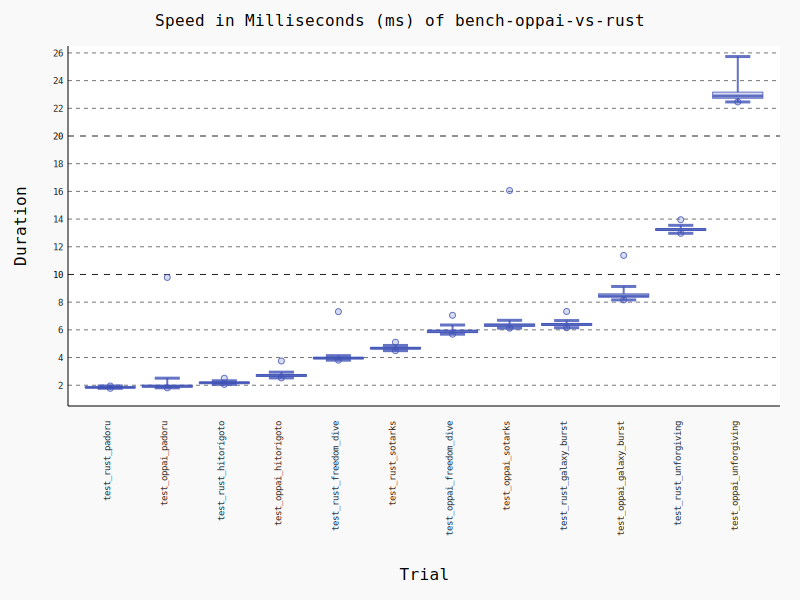
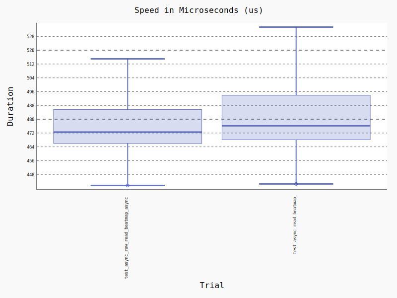
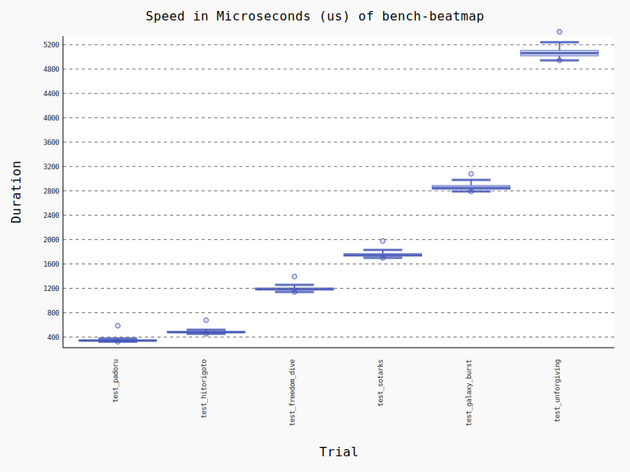
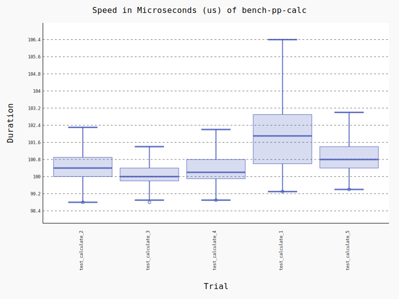

# peace-performance-python

*Fast, To calculate star ratings and performance points for all osu! gamemodes*

**[peace-performance](https://github.com/Pure-Peace/peace-performance)** (Rust) binding for python based on [PyO3](https://github.com/PyO3/pyo3).

Cross-platform support.
Support synchronous and asynchronous(tokio and async_std).

*Faster than oppai-ng, see the **[benchmark](https://github.com/Pure-Peace/peace-performance-python#vs-oppai-ng)** for details.*

**Note**: This library is not currently uploaded to PypI, you may need to download it locally for compilation and then import it in python.

## Minimal Examples

```python
from peace_performance_python.prelude import *

beatmap = await Beatmap.create_async('path_to_osu_file') # Beatmap can be cached and reused!
result = Calculator(acc=98.8, miss=3).calculate(beatmap) # Calculator can also
```

## Full Examples

```python
import asyncio
import sys

# import all
from peace_performance_python.prelude import *
# or
# from peace_performance_python.beatmap import Beatmap
# from peace_performance_python.calculator import Calculator

from tests import join_beatmap, HITORIGOTO


# Initial Rust logger (optional)
set_log_level('trace')
init_logger()


# Choose a style you like
def calculate_1(beatmap: Beatmap) -> CalcResult:
    return calculate_pp(beatmap, Calculator({'acc': 98.8, 'miss': 3}))


def calculate_2(beatmap: Beatmap) -> CalcResult:
    # --
    c = Calculator()
    c.set_acc(98.8)
    c.set_miss(3)

    # or
    c.acc = 98.8
    c.miss = 3

    # or
    c.setattr('acc', 98.8)
    c.setattr('miss', 3)
    return calculate_pp(beatmap, c)


def calculate_3(beatmap: Beatmap) -> CalcResult:
    c = Calculator()
    c.set_with_dict({'acc': 98.8, 'miss': 3})
    return calculate_pp(beatmap, c)


def calculate_4(beatmap: Beatmap) -> CalcResult:
    return Calculator({'acc': 98.8, 'miss': 3}).calculate(beatmap)


def calculate_5(beatmap: Beatmap) -> CalcResult:
    return Calculator(acc=98.8, miss=3).calculate(beatmap)


async def main():
    path = join_beatmap(HITORIGOTO)
    # Load beatmap
    beatmap = await Beatmap.create_async(path)
    # Sync
    # beatmap = Beatmap.create_sync(path) 
    # beatmap = Beatmap(path, initial_sync = True)
    print('\n**** Beatmap:', beatmap)

    # Calculate pp
    # result = calculate_5(beatmap)
    c = Calculator(acc=98.8, miss=3)
    print('\n***** Calculator as dict:', c.attrs_dict)
    result = c.calculate(beatmap)

    # Print results
    # print('\n***** result:', result)
    print('\n***** result.pp:', result.pp)
    print('\n***** result as dict:', result.attrs_dict)
    # print('\n***** result.raw_stars as dict:', result.raw_stars.attrs_dict)
    # print('\n***** result.raw_pp as dict:', result.raw_pp.attrs_dict)

    # Reset calculator
    c.reset()
    print('\n***** reseted Calculator as dict:', c.attrs_dict)

    # Calc again
    result2 = c.calculate(beatmap)
    print('\n***** result2 as dict:', result2)

if __name__ == '__main__':
    asyncio.run(main())

```

### Running results

```rust
 TRACE peace_performance_python::methods::common > function=async_read_file duration=319µs
 TRACE peace_performance_python::methods::pp     > function=async_parse_beatmap duration=421.3µs

**** Beatmap: <Beatmap object (path: ./test_beatmaps/hitorigoto.osu, is_initialized: True)>

***** Calculator as dict: {
    'mode': None, 
    'mods': None, 
    'n50': None, 
    'n100': None, 
    'n300': None, 
    'katu': None, 
    'acc': 98.80000305175781, 
    'passed_obj': None, 
    'combo': None, 
    'miss': 3
    }
 TRACE peace_performance_python::methods::pp     > function=calc_with_any_pp duration=98.3µs
 TRACE peace_performance_python::objects::calculator > function=calc duration=238µs


***** result.pp: 152.19204711914062


***** result as dict: {
    'mode': 0, 
    'mods': 0, 
    'pp': 152.19204711914062, 
    'stars': 5.162832260131836, 
    'raw_pp': {
        'aim': 73.0337905883789, 
        'spd': 31.048368453979492, 
        'str': None, 
        'acc': 45.17241287231445, 
        'total': 152.19204711914062}, 
    'raw_stars': {
        'stars': 5.162832260131836, 
        'max_combo': 476, 
        'ar': 9.0, 
        'n_fruits': None, 
        'n_droplets': None, 
        'n_tiny_droplets': None, 
        'od': 8.5, 
        'speed_strain': 2.0723509788513184, 
        'aim_strain': 2.7511043548583984, 
        'n_circles': 207, 
        'n_spinners': 1
        }
    }

...
```

---

## Building

This package is intended to be built using `rust`, `maturin` or `setuptools_rust`.

**1. Install Rust**

*posix*

```shell
curl --proto '=https' --tlsv1.2 -sSf https://sh.rustup.rs | sh
```

*windows*

```shell
https://static.rust-lang.org/rustup/dist/x86_64-pc-windows-msvc/rustup-init.exe
```

**2. Install python dev dependencies**

```shell
pip install -r requirements-dev.txt
```

**3. Build native python lib**

```shell
maturin develop --release
```

**OR**

```shell
python setup.py develop
```

#### Compile to `.whl` to use pip installation

```shell
maturin build --release
```

**OR**

```shell
python setup.py bdist_wheel
```

**install .whl**

```shell
# maturin build
pip install target/wheels/<name>.whl

# setup.py build
pip install dist/<name>.whl
```

---

## Run tests and benchmarks

Once built, you can run the tests and benchmakrs using `pytest`

```shell
pytest
```

**or bench and draw a image**

```shell
pytest --benchmark-histogram
```

**Run examples**

```shell
python examples.py
```

---

### Vs Oppai-ng

*peace-performance Python bindings vs [C89 oppai-ng](https://github.com/Francesco149/oppai-ng).*

Fast than oppai, the longer the map, the more obvious the advantages of rust.

peace-performance enables the `no_sliders_no_leniency` feature to be consistent with oppai's algorithm (faster, but loses precision).

If you need maximum precision (osu-performance) rather than performance, use `all_included` features.

```
------------------------------------------------------------------------ benchmark 'bench-oppai-vs-rust': 12 tests -------------------------------------------------------------------------
Name (time in ms)               Min                Max               Mean            StdDev             Median               IQR            Outliers       OPS            Rounds  Iterations
--------------------------------------------------------------------------------------------------------------------------------------------------------------------------------------------
test_rust_padoru             1.7768 (1.0)       1.9478 (1.0)       1.8508 (1.0)      0.0400 (1.0)       1.8443 (1.0)      0.0535 (1.0)          28;0  540.3156 (1.0)          87           1
test_oppai_padoru            1.8122 (1.02)      9.7861 (5.02)      1.9889 (1.07)     0.5237 (13.08)     1.9249 (1.04)     0.1314 (2.46)          7;8  502.7874 (0.93)        242           1
test_rust_hitorigoto         2.0610 (1.16)      2.5040 (1.29)      2.1910 (1.18)     0.0657 (1.64)      2.1785 (1.18)     0.0694 (1.30)        95;19  456.4104 (0.84)        418           1
test_oppai_hitorigoto        2.5288 (1.42)      3.7520 (1.93)      2.7401 (1.48)     0.1818 (4.54)      2.7067 (1.47)     0.1176 (2.20)        25;17  364.9477 (0.68)        322           1
test_rust_freedom_dive       3.8093 (2.14)      7.3134 (3.75)      3.9828 (2.15)     0.2293 (5.73)      3.9567 (2.15)     0.0845 (1.58)          4;6  251.0782 (0.46)        241           1
test_rust_sotarks            4.4968 (2.53)      5.1071 (2.62)      4.6848 (2.53)     0.0985 (2.46)      4.6712 (2.53)     0.0965 (1.80)        45;13  213.4562 (0.40)        196           1
test_oppai_freedom_dive      5.6872 (3.20)      7.0520 (3.62)      5.9250 (3.20)     0.2010 (5.02)      5.8822 (3.19)     0.1848 (3.46)         17;7  168.7767 (0.31)        159           1
test_oppai_sotarks           6.1222 (3.45)     16.0620 (8.25)      6.4435 (3.48)     0.8114 (20.27)     6.3351 (3.43)     0.1677 (3.14)         3;10  155.1956 (0.29)        152           1
test_rust_galaxy_burst       6.1535 (3.46)      7.3282 (3.76)      6.4249 (3.47)     0.1903 (4.75)      6.3857 (3.46)     0.1377 (2.57)        21;10  155.6452 (0.29)        148           1
test_oppai_galaxy_burst      8.1627 (4.59)     11.3769 (5.84)      8.5283 (4.61)     0.3584 (8.96)      8.4481 (4.58)     0.2359 (4.41)          9;6  117.2565 (0.22)        110           1
test_rust_unforgiving       12.9719 (7.30)     13.9540 (7.16)     13.2572 (7.16)     0.1567 (3.92)     13.2482 (7.18)     0.1395 (2.61)         16;4   75.4307 (0.14)         71           1
test_oppai_unforgiving      22.4598 (12.64)    35.3505 (18.15)    23.6072 (12.76)    2.4802 (61.97)    22.8837 (12.41)    0.4452 (8.32)          3;4   42.3600 (0.08)         44           1
--------------------------------------------------------------------------------------------------------------------------------------------------------------------------------------------

```



### Simple Benchmarks

*Native vs wrapped beatmap object*


*Read and parsing time spent on beatmap of different sizes*
(forgiving is a beatmap over 50 minutes long and takes the longest)


*There are also subtle differences in the different calling methods*


---

## MIT

pure-peace
