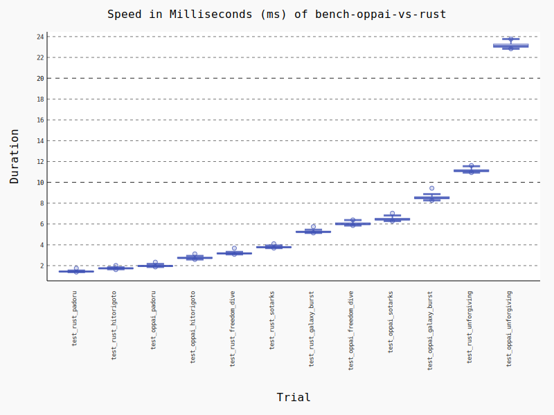
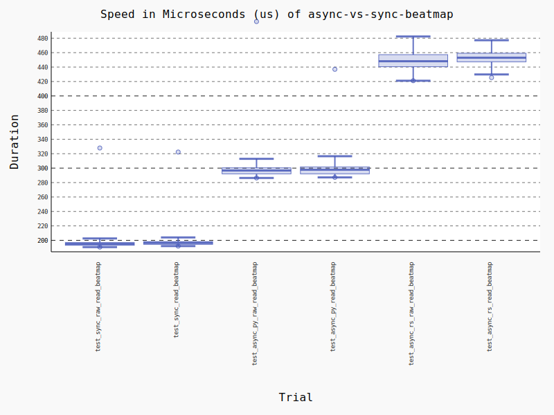
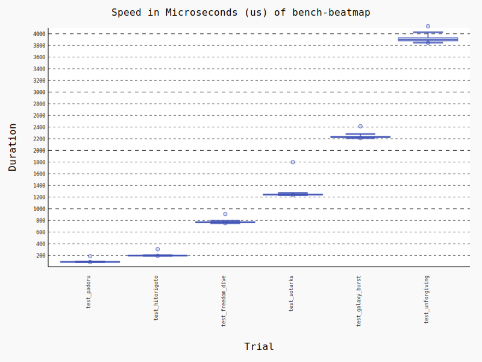
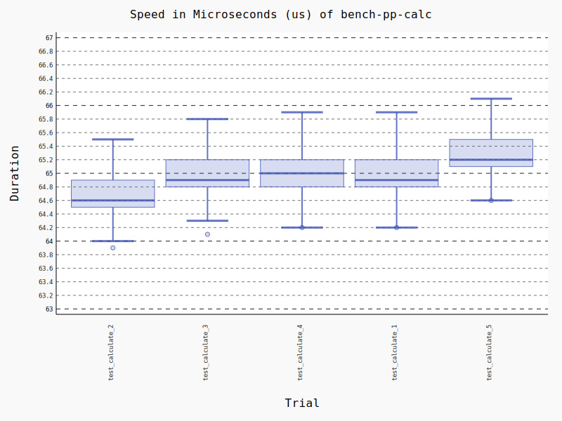

# peace-performance-python

*Fast, To calculate star ratings and performance points for all osu! gamemodes,*
*And, quickly parse Beatmap into python objects.*

#### PP Version: 21.07.27

**[peace-performance](https://github.com/Pure-Peace/peace-performance)** (Rust) binding for python based on [PyO3](https://github.com/PyO3/pyo3).

Cross-platform support.
Support synchronous and asynchronous(tokio and async_std).

*Faster than [oppai-ng](https://github.com/Francesco149/oppai-ng), see the **[benchmark](https://github.com/Pure-Peace/peace-performance-python#vs-oppai-ng)** for details.*

## Install by pip

PyPI: [https://pypi.org/project/peace-performance-python](https://pypi.org/project/peace-performance-python/)

```shell
pip install peace-performance-python
```

**Reliability**:

`check_your_osu_songs.py`

Testing on my local machine, about 70,000 maps can be calculated properly.

```shell
[ Walking (E:\osu\songs) Start... ]
[ 69146 ] .osu files founded...
[ Walking Done! ]
[ Start task ]
69146/69146; ok: 69142, err: 0; total time: 23825.90ms, avg: 0.34ms
[ All DONE ]
```

## PP Calculate

### Minimal Examples

```python
from peace_performance_python.prelude import *

# Beatmap can be cached and reused!
beatmap = Beatmap('path_to_osu_file') 
result = Calculator(acc=98.8, miss=3).calculate(beatmap)

# Async support!
beatmap = await Beatmap.create_async_rs('path_to_osu_file')
```

### Full Examples

```python
# import all
from peace_performance_python.prelude import *
# or
# from peace_performance_python.objects import Beatmap, Calculator

from tests import async_run, join_beatmap, HITORIGOTO, UNFORGIVING

# *No longer available by default (compile without `rust_logger` features enabled)*
# Initialize Rust logger (optional)
'''
set_log_level('trace')
init_logger()
'''


# Choose a style you like
def calculate(beatmap: Beatmap, calculator: Calculator) -> CalcResult:
    return calculator.calculate(beatmap)


def calculate_2(beatmap: Beatmap) -> CalcResult:
    # --
    c = Calculator()
    c.set_acc(98.8)
    c.set_miss(3)

    # or
    c.acc = 98.8
    c.miss = 3

    # or
    c.setattr('acc', 98.8)
    c.setattr('miss', 3)
    return calculate(beatmap, c)


def calculate_3(beatmap: Beatmap) -> CalcResult:
    c = Calculator()
    c.set_with_dict({'acc': 98.8, 'miss': 3})
    return calculate(beatmap, c)


def calculate_4(beatmap: Beatmap) -> CalcResult:
    return Calculator({'acc': 98.8, 'miss': 3}).calculate(beatmap)


def calculate_5(beatmap: Beatmap) -> CalcResult:
    return Calculator(acc=98.8, miss=3).calculate(beatmap)


async def main() -> None:
    path = join_beatmap(HITORIGOTO)
    # Load beatmap
    beatmap = Beatmap(path)
    # beatmap = Beatmap.create(path)

    # Async
    # beatmap = await Beatmap.create_async_rs(path)
    # beatmap = await Beatmap.create_async_py(path)
    # or
    # beatmap = await AsyncBeatmapRust(path)
    # beatmap = await AsyncBeatmapPython(path)
    print('\n>>>>> Beatmap:', beatmap)

    # Calculate pp
    # result = calculate_5(beatmap)
    c = Calculator(acc=98.8, miss=3)
    print('\n>>>>> Calculator as dict:', c.attrs_dict)
    result = c.calculate(beatmap)

    # Print results
    # print('\n>>>>> result:', result)
    print('\n>>>>> result.pp:', result.pp)
    print('\n>>>>> result as dict:', result.attrs_dict)
    # print('\n>>>>> result.raw_stars as dict:', result.raw_stars.attrs_dict)
    # print('\n>>>>> result.raw_pp as dict:', result.raw_pp.attrs_dict)

    # Reset calculator
    c.reset()
    print('\n>>>>> reseted Calculator as dict:', c.attrs_dict)

    # Calc again
    result2 = c.calculate(beatmap)
    print('\n>>>>> result2 as dict:', result2.attrs_dict)

    # Load another .osu files
    path2 = join_beatmap(UNFORGIVING)
    beatmap.init(path2)
    print(beatmap)

    # Convert calculate
    result3 = Calculator(mode=3).calculate(beatmap)
    print(result3)


if __name__ == '__main__':
    async_run(main())

```

### Running results

```rust
 TRACE peace_performance_python::methods::common > function=sync_read_file duration=73.3µs
 TRACE peace_performance_python::methods::pp     > function=sync_parse_beatmap duration=181.9µs

>>>>> Beatmap: <Beatmap object (
        path: ./test_beatmaps/hitorigoto.osu, 
        is_initialized: True, 
        mode: 0, 
        mode_str: std, 
        version: 14, 
        n_circles: 207, 
        n_sliders: 132, 
        n_spinners: 1, 
        ar: 9, 
        od: 8.5, 
        cs: 4, 
        hp: 6, 
        sv: 1.7, 
        tick_rate: 1, 
        stack_leniency: None
    )>

>>>>> Calculator as dict: {
    'mode': None, 
    'mods': None, 
    'n50': None, 
    'n100': None, 
    'n300': None, 
    'katu': None, 
    'acc': 98.80000305175781, 
    'passed_obj': None, 
    'combo': None, 
    'miss': 3
    }
 TRACE peace_performance_python::methods::pp         > function=calc_with_any_pp duration=55.7µs
 TRACE peace_performance_python::objects::calculator > function=calc duration=103.2µs


>>>>> result.pp: 152.19204711914062


>>>>> result as dict: {
    'mode': 0, 
    'mods': 0, 
    'pp': 152.19204711914062, 
    'stars': 5.162832260131836, 
    'raw_pp': {
        'aim': 73.0337905883789, 
        'spd': 31.048368453979492, 
        'str': None, 
        'acc': 45.17241287231445, 
        'total': 152.19204711914062}, 
    'raw_stars': {
        'stars': 5.162832260131836, 
        'max_combo': 476, 
        'ar': 9.0, 
        'n_fruits': None, 
        'n_droplets': None, 
        'n_tiny_droplets': None, 
        'od': 8.5, 
        'speed_strain': 2.0723509788513184, 
        'aim_strain': 2.7511043548583984, 
        'n_circles': 207, 
        'n_spinners': 1
        }
    }

...
```

---

## Beatmap parse

### Examples

```python
from peace_performance_python.prelude import *
from tests import join_beatmap, HITORIGOTO

# Initialize Rust logger (optional)
set_log_level('trace')
init_logger()


def main():
    path = join_beatmap(HITORIGOTO)
    # Load beatmap
    b = Beatmap(path)
    print('\n>>>>> Beatmap:', b)
    print('\n>>>>> Beatmap.hit_objects (0-3):', b.hit_objects[:3])
    print('\n>>>>> Beatmap.timing_points:', b.timing_points)
    print('\n>>>>> Beatmap.difficulty_points (0-3):', b.difficulty_points[:3])
    print('\n>>>>> Beatmap.hit_objects[0].pos:', b.hit_objects[0].pos)
    print('\n>>>>> Beatmap.hit_objects[3].kind:', b.hit_objects[3].kind)
    print('\n>>>>> Beatmap.hit_objects[3].kind.curve_points:',
          b.hit_objects[3].kind.curve_points)

    pos_0 = b.hit_objects[0].pos
    pos_1 = b.hit_objects[1].pos
    print('\n>>>>> Beatmap object(0):', b.hit_objects[0])
    print('\n>>>>> Beatmap object(1):', b.hit_objects[1])
    print('\n>>>>> Beatmap object pos(0):', pos_0)
    print('\n>>>>> Beatmap object pos(1):', pos_1)
    print('\n>>>>> Beatmap object pos(0) length, squared:',
          pos_0.length, pos_0.length_squared)
    print('\n>>>>> Beatmap object pos(0 and 1) distance:', pos_0.distance(pos_1))
    print('\n>>>>> Beatmap object pos(0 and 1) add:', pos_0.add(pos_1))
    print('\n>>>>> Beatmap object pos(0 and 1) sub:', pos_0.sub(pos_1))


if __name__ == '__main__':
    main()

```

### Running results

```rust
 TRACE peace_performance_python::methods::common > function=sync_read_file duration=78.3µs
 TRACE peace_performance_python::methods::pp     > function=sync_parse_beatmap duration=193.4µs

>>>>> Beatmap: <Beatmap object (
        path: ./test_beatmaps/hitorigoto.osu, 
        is_initialized: True, 
        mode: 0, mode_str: std, version: 14, 
        n_circles: 207, n_sliders: 132, n_spinners: 1, 
        ar: 9, od: 8.5, cs: 4, hp: 6, sv: 1.7, tick_rate: 1, 
        stack_leniency: None
    ), hidden: hit_objects, timing_points, difficulty_points>

>>>>> Beatmap.hit_objects (0-3): [
    <HitObject object (
        start_time: 536, sound: 4, end_time: 536, kind: circle, pos: (44, 136))>, 
    <HitObject object (
        start_time: 717, sound: 0, end_time: 717, kind: circle, pos: (315, 196))>, 
    <HitObject object (
        start_time: 899, sound: 0, end_time: 899, kind: slider, pos: (152, 304))>]

>>>>> Beatmap.timing_points: [<TimingPoint object (time: 536, beat_len: 363.63635)>]

>>>>> Beatmap.difficulty_points (0-3): [
    <DifficultyPoint object (time: 23808, speed_multiplier: 1)>, 
    <DifficultyPoint object (time: 35445, speed_multiplier: 0.8)>, 
    <DifficultyPoint object (time: 41263, speed_multiplier: 1)>]

>>>>> Beatmap.hit_objects[0].pos: <Pos2 object (x: 44, y: 136)>

>>>>> Beatmap.hit_objects[3].kind: <HitObjectKind object (
    kind: slider, pixel_len: Some(85.0), repeats: Some(1), 
    path_type: Some("perfect_curve"), end_time: None)>

>>>>> Beatmap.hit_objects[3].kind.curve_points: [
    <Pos2 object (x: 315, y: 196)>, 
    <Pos2 object (x: 277, y: 176)>, 
    <Pos2 object (x: 248, y: 145)>]

>>>>> Beatmap object(0): <HitObject object (
    start_time: 536, sound: 4, end_time: 536, kind: circle, pos: (44, 136))>

>>>>> Beatmap object(1): <HitObject object (
    start_time: 717, sound: 0, end_time: 717, kind: circle, pos: (315, 196))>

>>>>> Beatmap object pos(0): <Pos2 object (x: 44, y: 136)>

>>>>> Beatmap object pos(1): <Pos2 object (x: 315, y: 196)>

>>>>> Beatmap object pos(0) length, squared: 142.9405517578125 20432.0

>>>>> Beatmap object pos(0 and 1) distance: 277.5625915527344

>>>>> Beatmap object pos(0 and 1) add: <Pos2 object (x: 359, y: 332)>

>>>>> Beatmap object pos(0 and 1) sub: <Pos2 object (x: -271, y: -60)>

```

---

## Building

This package is intended to be built using `rust`, `maturin` or `setuptools_rust`.

**1. Install Rust**

*posix*

```shell
curl --proto '=https' --tlsv1.2 -sSf https://sh.rustup.rs | sh
```

*windows*

```shell
https://static.rust-lang.org/rustup/dist/x86_64-pc-windows-msvc/rustup-init.exe
```

**2. Install python dev dependencies**

```shell
pip install -r requirements-dev.txt
```

**3. Build native python lib**

```shell
maturin develop --release
```

**OR**

```shell
python setup.py develop
```

#### Compile to `.whl` to use pip installation

```shell
maturin build --release
```

**OR**

```shell
python setup.py bdist_wheel
```

**install .whl**

```shell
# maturin build
pip install target/wheels/<name>.whl

# setup.py build
pip install dist/<name>.whl
```

---

## Run tests and benchmarks

Once built, you can run the tests and benchmakrs using `pytest`

```shell
pytest
```

**or bench and draw a image**

```shell
pytest --benchmark-histogram
```

**Complete bench**

```shell
pytest --benchmark-disable-gc --benchmark-warmup=True --benchmark-histogram
```

**Run examples**

```shell
python examples.py
```

---

### Features

| Flag                     | Description                                                                                                                                                                          |
| ------------------------ | ------------------------------------------------------------------------------------------------------------------------------------------------------------------------------------ |
| **`default`**            | Enable **async_tokio**, **all modes** and choose the **`all_included`** version for osu!standard. Set `default_features = false` to disable.                                         |
| **`score_v2_buff`**      | **Buff ScoreV2 (STD)** - `acc *= 1.25`                                                                                                                                               |
| **`ppysb_edition`**      | Special changes for **RELAX** and **AUTOPILOT**                                                                                                                                      |
| `relax_nerf`             | *Nerf relax and autopilot pp.* Relax: `aim * 0.9, spd * 0.3, acc *0.8`; Autopilot: `aim * 0.3, spd * 0.9, acc * 0.8`                                                                 |
| `taiko`                  | Enable osu!taiko.                                                                                                                                                                    |
| `fruits`                 | Enable osu!ctb.                                                                                                                                                                      |
| `mania`                  | Enable osu!mania.                                                                                                                                                                    |
| `osu`                    | Enable osu!standard. Requires to also enable exactly one of the features `no_leniency`, `no_sliders_no_leniency`, or `all_included`.                                                 |
| **`no_leniency`**        | When calculating difficulty attributes in osu!standard, ignore stack leniency but consider sliders. Solid middleground between performance and precision, hence the default version. |
| `no_sliders_no_leniency` | When calculating difficulty attributes in osu!standard, ignore stack leniency and sliders. Best performance but slightly less precision than `no_leniency`.                          |
| `all_included`           | When calculating difficulty attributes in osu!standard, consider both stack leniency and sliders. Best precision but significantly worse performance than `no_leniency`.             |
| `async_tokio`            | Beatmap parsing will be async through [tokio](https://github.com/tokio-rs/tokio)                                                                                                     |
| `async_std`              | Beatmap parsing will be async through [async-std](https://github.com/async-rs/async-std)                                                                                             |

### Vs Oppai-ng

*peace-performance Python bindings vs [C89 oppai-ng](https://github.com/Francesco149/oppai-ng) Python bindings.*

Rust is Faster. The longer the map, the more obvious the advantages of rust.

peace-performance enables the `no_sliders_no_leniency` feature to be consistent with oppai's algorithm (faster, but loses precision).

If you need maximum precision (osu-performance) rather than performance, use `all_included` features.

**This test was run on my subsystem and had performance issues with a minimum time greater than 1ms.**
(The minimum time in windows is **86us** (padoru) and the next smallest is **192us** (hitorigoto)

```shell
------------------------------------------------------------------------ benchmark 'bench-oppai-vs-rust': 12 tests -------------------------------------------------------------------------
Name (time in ms)               Min                Max               Mean            StdDev             Median               IQR            Outliers       OPS            Rounds  Iterations
--------------------------------------------------------------------------------------------------------------------------------------------------------------------------------------------
test_rust_padoru             1.3805 (1.0)       1.7463 (1.0)       1.4447 (1.0)      0.0518 (1.0)       1.4301 (1.0)      0.0444 (1.01)        68;32  692.1759 (1.0)         358           1
test_rust_hitorigoto         1.6154 (1.17)      2.0133 (1.15)      1.7433 (1.21)     0.0587 (1.13)      1.7407 (1.22)     0.0439 (1.0)        129;82  573.6085 (0.83)        498           1
test_oppai_padoru            1.8734 (1.36)      2.3294 (1.33)      1.9799 (1.37)     0.0845 (1.63)      1.9659 (1.37)     0.0931 (2.12)        47;11  505.0744 (0.73)        204           1
test_oppai_hitorigoto        2.5925 (1.88)      3.1272 (1.79)      2.7537 (1.91)     0.0883 (1.70)      2.7357 (1.91)     0.0887 (2.02)        84;21  363.1464 (0.52)        346           1
test_rust_freedom_dive       3.0829 (2.23)      3.6729 (2.10)      3.1865 (2.21)     0.0687 (1.33)      3.1715 (2.22)     0.0685 (1.56)        70;18  313.8282 (0.45)        303           1
test_rust_sotarks            3.6848 (2.67)      4.0976 (2.35)      3.7886 (2.62)     0.0748 (1.45)      3.7676 (2.63)     0.0748 (1.70)        51;17  263.9489 (0.38)        240           1
test_rust_galaxy_burst       5.1418 (3.72)      5.7422 (3.29)      5.2629 (3.64)     0.0851 (1.64)      5.2349 (3.66)     0.0911 (2.08)         44;9  190.0092 (0.27)        184           1
test_oppai_freedom_dive      5.8532 (4.24)      6.3883 (3.66)      6.0279 (4.17)     0.1154 (2.23)      5.9971 (4.19)     0.1660 (3.78)         45;2  165.8948 (0.24)        161           1
test_oppai_sotarks           6.2822 (4.55)      7.0327 (4.03)      6.4706 (4.48)     0.1350 (2.61)      6.4400 (4.50)     0.1544 (3.52)         36;4  154.5453 (0.22)        145           1
test_oppai_galaxy_burst      8.2669 (5.99)      9.4358 (5.40)      8.5453 (5.91)     0.1838 (3.55)      8.5012 (5.94)     0.1732 (3.95)         25;8  117.0232 (0.17)        114           1
test_rust_unforgiving       10.9350 (7.92)     11.6170 (6.65)     11.1305 (7.70)     0.1289 (2.49)     11.1028 (7.76)     0.1701 (3.87)         26;2   89.8429 (0.13)         88           1
test_oppai_unforgiving      22.8311 (16.54)    23.7671 (13.61)    23.1481 (16.02)    0.2352 (4.54)     23.0818 (16.14)    0.2999 (6.83)         10;1   43.2001 (0.06)         43           1
--------------------------------------------------------------------------------------------------------------------------------------------------------------------------------------------
```



### Simple Benchmarks

****Native** vs **Wrapped** beatmap object*,
**Sync** vs **Async**,
**Py async** vs **Rust async***

**Note: Rust has its own event loop (independent of python) and has performance issues due to rust's need to convert built-in futures to python coroutine. So rust async is the worst performer.**


*Read and parsing time spent on beatmap of different sizes*
(forgiving is a beatmap over 50 minutes long and takes the longest)


*There are also subtle differences in the different calling methods*


---

## MIT

pure-peace
